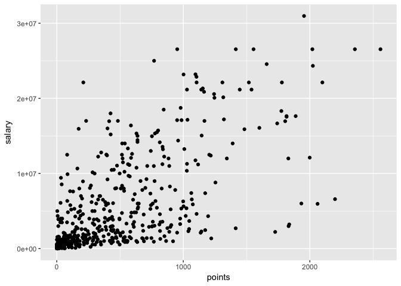
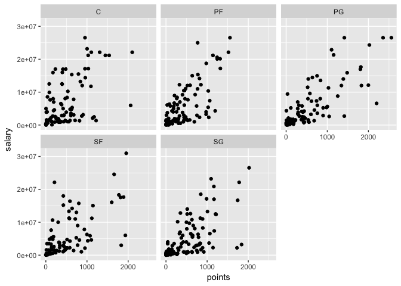
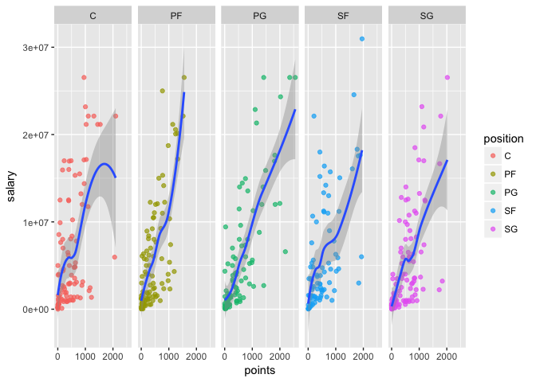
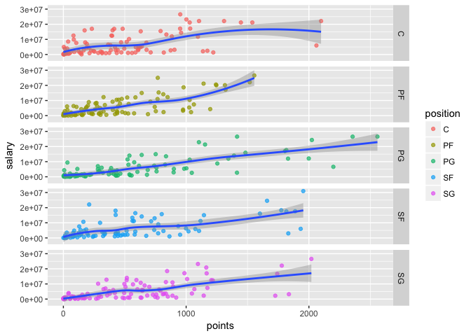

Lab 4: First contact with dplyr and ggplot2
================
Gaston Sanchez

> ### Learning Objectives:
> 
>   - Get started with `"dplyr"`
>   - Get to know the basic dplyr verbs:
>   - `slice()`, `filter()`, `select()`
>   - `mutate()`
>   - `arrange()`
>   - `summarise()`
>   - `group_by()`
>   - Get started with `"ggplot2"`
>   - Produce basic plots with `ggplot()`

### General Instructions

  - Write your descriptions, explanations, and code in an `Rmd` (R
    markdown) file.
  - Name this file as `lab04-first-last.Rmd`, where `first` and `last`
    are your first and last names (e.g. `lab04-gaston-sanchez.Rmd`).
  - If you attend lab, to achieve **substantial progress** you have to
    complete the “Your Turn\*" sections marked with a star.
  - Knit your `Rmd` file as an html document (default option).
  - Submit your `Rmd` and `html` files to bCourses, in the corresponding
    lab assignment.

-----

## Manipulating and Visualizing Data Frames

So far you’ve been manipulating data tables (under the class of
`"data.frame"` objects) using bracket notation, `dat[ , ]`, and the
dollar operator, `dat$name`, in order to select specific rows, columns,
or cells. In addition, you’ve created charts with functions like
`plot()`, `boxplot()`, `barplot()`, and `hist()`, which are part of the
`"graphics"` package.

In this lab, you will start learning about other approaches to
manipulate tables and create statistical graphics. We are going to use
the functionality of the package `"dplyr"` to work with tabular data in
a more syntactic way. This is a fairly recent package introduced a
couple of years ago, but it is based on more than a decade of research
and work lead by Hadley Wickham.

Likewise, to create graphics in a more consistent and visually pleasing
way, we are going to use the package `"ggplot2"`, also originally
authored by Hadley Wickham, and developed as part of his PhD more than a
decade ago.

Use the first hour of the lab to get as far as possible with the
material associated to `"dplyr"`. Then use the second hour of the lab to
work on graphics with `"ggplot2"`.

While you follow this lab, you may want to open these cheat sheets:

  - [dplyr
    cheatsheet](https://github.com/ucb-stat133/stat133-cheatsheets/blob/master/data-transformation-cheatsheet.pdf)
  - [ggplot2
    cheatsheet](https://github.com/ucb-stat133/stat133-cheatsheets/blob/master/ggplot2-cheatsheet-2.1.pdf)

-----

### Installing packages

I’m assuming that you already installed the packages `"dplyr"` and
`"ggplot2"`. If that’s not the case then **run on the console** the
command below (do NOT include this command in your `Rmd`):

``` r
# don't include this command in your Rmd file
# don't worry too much if you get a warning message
install.packages(c("dplyr", "ggplot2"))
```

Remember that you only need to install a package once\! After a package
has been installed in your machine, there is no need to call
`install.packages()` again on the same package. What you should always
invoke in order to use the functions in a package is the `library()`
function:

``` r
# (include these commands in your Rmd file)
# don't forget to load the packages
library(dplyr)
library(ggplot2)
```

**About loading packages:** Another rule to keep in mind is to always
load any required packages at the very top of your script files (`.R` or
`.Rmd` or `.Rnw` files). Avoid calling the `library()` function in the
middle of a script. Instead, load all the packages before anything else.

-----

## NBA Players Data

The data file for this lab is: `nba2018-players.csv`.

To import the data in R you can use the base function `read.csv()`, or
you can also use `read_csv()` from the package `"readr"`:

``` r
# with "base" read.csv()
dat <- read.csv('nba2018-players.csv', stringsAsFactors = FALSE)

# with "readr" read_csv()
dat <- read_csv('nba2018-players.csv')
```

-----

## Basic `"dplyr"` verbs

To make the learning process of `"dplyr"` gentler, Hadley Wickham
proposes beginning with a set of five *basic verbs* or operations for
data frames (each verb corresponds to a function in `"dplyr"`):

  - **filter**: keep rows matching criteria
  - **select**: pick columns by name
  - **mutate**: add new variables
  - **arrange**: reorder rows
  - **summarise**: reduce variables to values

These are the verbs or *actions* you were introduced to in last week’s
lab. I’ve slightly modified Hadley’s list of verbs:

  - `filter()`, `slice()`, and `select()`: subsetting and selecting rows
    and columns
  - `mutate()`: add new variables
  - `arrange()`: reorder rows
  - `summarise()`: reduce variables to values
  - `group_by()`: grouped (aggregate) operations

-----

## Filtering, slicing, and selecting

`slice()` allows you to select rows by position:

``` r
# first three rows
three_rows <- slice(dat, 1:3)
three_rows
```

    ##          player team position height weight age experience
    ## 1    Al Horford  BOS        C     82    245  30          9
    ## 2  Amir Johnson  BOS       PF     81    240  29         11
    ## 3 Avery Bradley  BOS       SG     74    180  26          6
    ##                         college   salary games minutes points points3
    ## 1         University of Florida 26540100    68    2193    952      86
    ## 2                               12000000    80    1608    520      27
    ## 3 University of Texas at Austin  8269663    55    1835    894     108
    ##   points2 points1
    ## 1     293     108
    ## 2     186      67
    ## 3     251      68

`filter()` allows you to select rows by condition:

``` r
# subset rows given a condition
# (height greater than 85 inches)
gt_85 <- filter(dat, height > 85)
gt_85
```

    ##               player team position height weight age experience
    ## 1        Edy Tavares  CLE        C     87    260  24          1
    ## 2   Boban Marjanovic  DET        C     87    290  28          1
    ## 3 Kristaps Porzingis  NYK       PF     87    240  21          1
    ## 4        Roy Hibbert  DEN        C     86    270  30          8
    ## 5      Alexis Ajinca  NOP        C     86    248  28          6
    ##                 college  salary games minutes points points3 points2
    ## 1                          5145     1      24      6       0       3
    ## 2                       7000000    35     293    191       0      72
    ## 3                       4317720    66    2164   1196     112     331
    ## 4 Georgetown University 5000000     6      11      4       0       2
    ## 5                       4600000    39     584    207       0      89
    ##   points1
    ## 1       0
    ## 2      47
    ## 3     198
    ## 4       0
    ## 5      29

`select()` allows you to select columns by name:

``` r
# columns by name
player_height <- select(dat, player, height)
```

### Your turn\*:

  - use `slice()` to subset the data by selecting the first 5 rows.
  - use `slice()` to subset the data by selecting rows 10, 15, 20, …,
    50.
  - use `slice()` to subset the data by selecting the last 5 rows.
  - use `filter()` to subset those players with height less than 70
    inches tall.
  - use `filter()` to subset rows of Golden State Warriors (`'GSW'`).
  - use `filter()` to subset rows of GSW centers (`'C'`).
  - use `filter()` and then `select()`, to subset rows of lakers
    (`'LAL'`), and then display their names.
  - use `filter()` and then `select()`, to display the name and salary,
    of GSW point guards
  - find how to select the name, age, and team, of players with more
    than 10 years of experience, making 10 million dollars or less.
  - find how to select the name, team, height, and weight, of rookie
    players, 20 years old, displaying only the first five occurrences
    (i.e. rows)

-----

## Adding new variables: `mutate()`

Another basic verb is `mutate()` which allows you to add new variables.
Let’s create a small data frame for the warriors with three columns:
`player`, `height`, and `weight`:

``` r
# creating a small data frame step by step
gsw <- filter(dat, team == 'GSW')
gsw <- select(gsw, player, height, weight)
gsw <- slice(gsw, c(4, 8, 10, 14, 15))
gsw
```

    ##             player height weight
    ## 1       David West     81    250
    ## 2     JaVale McGee     84    270
    ## 3     Kevon Looney     81    220
    ## 4 Shaun Livingston     79    192
    ## 5    Stephen Curry     75    190

Now, let’s use `mutate()` to (temporarily) add a column with the ratio
`height / weight`:

``` r
mutate(gsw, height / weight)
```

    ##             player height weight height/weight
    ## 1       David West     81    250     0.3240000
    ## 2     JaVale McGee     84    270     0.3111111
    ## 3     Kevon Looney     81    220     0.3681818
    ## 4 Shaun Livingston     79    192     0.4114583
    ## 5    Stephen Curry     75    190     0.3947368

You can also give a new name, like: `ht_wt = height / weight`:

``` r
mutate(gsw, ht_wt = height / weight)
```

    ##             player height weight     ht_wt
    ## 1       David West     81    250 0.3240000
    ## 2     JaVale McGee     84    270 0.3111111
    ## 3     Kevon Looney     81    220 0.3681818
    ## 4 Shaun Livingston     79    192 0.4114583
    ## 5    Stephen Curry     75    190 0.3947368

In order to permanently change the data, you need to assign the changes
to an object:

``` r
gsw2 <- mutate(gsw, ht_m = height * 0.0254, wt_kg = weight * 0.4536)
gsw2
```

    ##             player height weight   ht_m    wt_kg
    ## 1       David West     81    250 2.0574 113.4000
    ## 2     JaVale McGee     84    270 2.1336 122.4720
    ## 3     Kevon Looney     81    220 2.0574  99.7920
    ## 4 Shaun Livingston     79    192 2.0066  87.0912
    ## 5    Stephen Curry     75    190 1.9050  86.1840

## Reordering rows: `arrange()`

The next basic verb of `"dplyr"` is `arrange()` which allows you to
reorder rows. For example, here’s how to arrange the rows of `gsw` by
`height`

``` r
# order rows by height (increasingly)
arrange(gsw, height)
```

    ##             player height weight
    ## 1    Stephen Curry     75    190
    ## 2 Shaun Livingston     79    192
    ## 3       David West     81    250
    ## 4     Kevon Looney     81    220
    ## 5     JaVale McGee     84    270

By default `arrange()` sorts rows in increasing order. To arrange rows
in descending order you need to use the auxiliary function `desc()`.

``` r
# order rows by height (decreasingly)
arrange(gsw, desc(height))
```

    ##             player height weight
    ## 1     JaVale McGee     84    270
    ## 2       David West     81    250
    ## 3     Kevon Looney     81    220
    ## 4 Shaun Livingston     79    192
    ## 5    Stephen Curry     75    190

``` r
# order rows by height, and then weight
arrange(gsw, height, weight)
```

    ##             player height weight
    ## 1    Stephen Curry     75    190
    ## 2 Shaun Livingston     79    192
    ## 3     Kevon Looney     81    220
    ## 4       David West     81    250
    ## 5     JaVale McGee     84    270

-----

### Your Turn\*:

  - using the data frame `gsw`, add a new variable `product` with the
    product of `height` and `weight`.

  - create a new data frame `gsw3`, by adding columns `log_height` and
    `log_weight` with the log transformations of `height` and `weight`.

  - use the original data frame to `filter()` and `arrange()` those
    players with height less than 71 inches tall, in increasing order.

  - display the name, team, and salary, of the top-5 highest paid
    players

  - display the name, team, and salary, for the top-5 highest paid
    players

  - display the name, team, and points3, of the top 10 three-point
    players

  - create a data frame `gsw_mpg` of GSW players, that contains
    variables for player name, experience, and `min_per_game` (minutes
    per game), sorted by `min_per_game` (in descending order)

-----

## Summarizing values with `summarise()`

The next verb is `summarise()`. Conceptually, this involves applying a
function on one or more columns, in order to summarize values. This is
probably easier to understand with one example.

Say you are interested in calculating the average salary of all NBA
players. To do this “a la dplyr” you use `summarise()`, or its synonym
function `summarize()`:

``` r
# average salary of NBA players
summarise(dat, avg_salary = mean(salary))
```

    ##   avg_salary
    ## 1    5804697

Calculating an average like this seems a bit *verbose*, especially when
you can directly use `mean()` like this:

``` r
mean(dat$salary)
```

    ## [1] 5804697

So let’s make things a bit more interessting. What if you want to
calculate some summary statistics for `salary`: min, median, mean, and
max?

``` r
# some stats for salary (dplyr)
summarise(
  dat, 
  min = min(salary),
  median = median(salary),
  avg = mean(salary),
  max = max(salary)
)
```

    ##    min median     avg      max
    ## 1 5145  3e+06 5804697 30963450

Well, this may still look like not much. You can do the same in base R
(there are actually better ways to do this):

``` r
# some stats for salary (base R)
c(min = min(dat$salary), 
  median = median(dat$salary),
  median = mean(dat$salary),
  max = max(dat$salary))
```

    ##      min   median   median      max 
    ##     5145  3000000  5804697 30963450

## Grouped operations

To actually appreciate the power of `summarise()`, we need to introduce
the other major basic verb in `"dplyr"`: `group_by()`. This is the
function that allows you to perform data aggregations, or *grouped
operations*.

Let’s see the combination of `summarise()` and `group_by()` to calculate
the average salary by team:

``` r
# average salary, grouped by team
summarise(
  group_by(dat, team),
  avg_salary = mean(salary)
)
```

    ## # A tibble: 30 x 2
    ##    team  avg_salary
    ##    <chr>      <dbl>
    ##  1 ATL     5494447.
    ##  2 BOS     6127673.
    ##  3 BRK     4011351.
    ##  4 CHI     5781368.
    ##  5 CHO     5531548.
    ##  6 CLE     7069699.
    ##  7 DAL     5157128.
    ##  8 DEN     4648719.
    ##  9 DET     6871632.
    ## 10 GSW     6265160.
    ## # … with 20 more rows

Here’s a similar example with the average salary by position:

``` r
# average salary, grouped by position
summarise(
  group_by(dat, position),
  avg_salary = mean(salary)
)
```

    ## # A tibble: 5 x 2
    ##   position avg_salary
    ##   <chr>         <dbl>
    ## 1 C          6529906.
    ## 2 PF         5801127.
    ## 3 PG         5601217.
    ## 4 SF         6042455.
    ## 5 SG         5114178.

Here’s a more fancy example: average weight and height, by position,
displayed in desceding order by average height:

``` r
arrange(
  summarise(
    group_by(dat, position),
    avg_height = mean(height),
    avg_weight = mean(weight)),
  desc(avg_height)
)
```

    ## # A tibble: 5 x 3
    ##   position avg_height avg_weight
    ##   <chr>         <dbl>      <dbl>
    ## 1 C              83.2       251.
    ## 2 PF             81.4       235.
    ## 3 SF             79.5       220.
    ## 4 SG             77.0       204.
    ## 5 PG             74.3       189.

### Your turn:

  - use `summarise()` to get the largest height value.

  - use `summarise()` to get the standard deviation of `points3`.

  - use `summarise()` and `group_by()` to display the median of
    three-points, by team.

  - display the average triple points by team, in ascending order, of
    the bottom-5 teams (worst 3pointer teams)

  - obtain the mean and standard deviation of `age`, for Power Forwards,
    with 5 and 10 years of experience (including 5 and 10).

-----

# First contact with `ggplot()`

The package `"ggplot2"` is probably the most popular package in R to
create *beautiful* static graphics. Compared to the functions in the
base package `"graphics"`, the package `"ggplot2`" follows a somewhat
different philosophy, and it tries to be more consistent and modular as
possible.

  - The main function in `"ggplot2"` is `ggplot()`
  - The main input to `ggplot()` is a data frame object.
  - You can use the internal function `aes()` to specify what columns of
    the data frame will be used for the graphical elements of the plot.
  - You must specify what kind of *geometric objects* or **geoms** will
    be displayed: e.g. `geom_point()`, `geom_bar()`, `geom_boxpot()`.
  - Pretty much anything else that you want to add to your plot is
    controlled by auxiliary functions, especially those things that have
    to do with the format, rather than the underlying data.
  - The construction of a ggplot is done by *adding layers* with the `+`
    operator.

### Scatterplots

Let’s start with a scatterplot of `salary` and `points`

``` r
# scatterplot (option 1)
ggplot(data = dat) +
  geom_point(aes(x = points, y = salary))
```

<!-- -->

  - `ggplot()` creates an object of class `"ggplot"`
  - the main input for `ggplot()` is `data` which must be a data frame
  - then we use the `"+"` operator to add a layer
  - the geometric object (geom) are points: `geom_points()`
  - `aes()` is used to specify the `x` and `y` coordinates, by taking
    columns `points` and `salary` from the data frame

The same scatterplot can also be created with this alternative, and more
common use of `ggplot()`

``` r
# scatterplot (option 2)
ggplot(data = dat, aes(x = points, y = salary)) +
  geom_point()
```

### Label your chunks\!

When including code for plots and graphics, we strongly recommend that
you create an individual code chunk for each plot, and that you **give a
label** to that chunk. This is illustrated in the following screenshot.


Note that the code chunk has a label `scatterplot1`; moreover, the code
is exclusively decidated to this plot. Why should you care? Because when
`"knitr"` creates the file of the plot, it will use the chunk label for
the graph. So it’s better to give meaningful names to those chunks
containing graphics.

### Adding color

Say you want to color code the points in terms of `position`

``` r
# colored scatterplot 
ggplot(data = dat, aes(x = points, y = salary)) +
  geom_point(aes(color = position))
```

Maybe you wan to modify the size of the dots in terms of `points3`:

``` r
# sized and colored scatterplot 
ggplot(data = dat, aes(x = points, y = salary)) +
  geom_point(aes(color = position, size = points3))
```

To add some transparency effect to the dots, you can use the `alpha`
parameter.

``` r
# sized and colored scatterplot 
ggplot(data = dat, aes(x = points, y = salary)) +
  geom_point(aes(color = position, size = points3), alpha = 0.7)
```

Notice that `alpha` was specified outside `aes()`. This is because we
are not using any column for the `alpha` transparency values.

### Your turn\*:

  - Open the [ggplot2
    cheatsheet](https://github.com/ucb-stat133/stat133-cheatsheets/blob/master/ggplot2-cheatsheet-2.1.pdf)
  - Use the data frame `gsw` to make a scatterplot of `height` and
    `weight`.
  - Find out how to make another scatterplot of `height` and `weight`,
    using `geom_text()` to display the names of the players.
  - Get a scatter plot of `height` and `weight`, for ALL the warriors,
    displaying their names with `geom_label()`.
  - Get a density plot of `salary` (for all NBA players).
  - Get a histogram of `points2` with binwidth of 50 (for all NBA
    players).
  - Get a barchart of the `position` frequencies (for all NBA players).
  - Make a scatterplot of `experience` and `salary` of all Centers, and
    use `geom_smooth()` to add a regression line.
  - Repeat the same scatterplot of `experience` and `salary` of all
    Centers, but now use `geom_smooth()` to add a loess line
    (i.e. smooth line).

-----

## Faceting

One of the most attractive features of `"ggplot2"` is the ability to
display multiple **facets**. The idea of facets is to divide a plot into
subplots based on the values of one or more categorical (or discrete)
variables.

Here’s an example. What if you want to get scatterplots of `points` and
`salary` separated (or grouped) by `position`? This is where faceting
comes handy, and you can use `facet_wrap()` for this purpose:

``` r
# scatterplot by position
ggplot(data = dat, aes(x = points, y = salary)) +
  geom_point() +
  facet_wrap(~ position)
```

<!-- -->

The other faceting function is `facet_grid()`, which allows you to
control the layout of the facets (by rows, by columns, etc)

``` r
# scatterplot by position
ggplot(data = dat, aes(x = points, y = salary)) +
  geom_point(aes(color = position), alpha = 0.7) +
  facet_grid(~ position) +
  geom_smooth(method = loess)
```

<!-- -->

``` r
# scatterplot by position
ggplot(data = dat, aes(x = points, y = salary)) +
  geom_point(aes(color = position), alpha = 0.7) +
  facet_grid(position ~ .) +
  geom_smooth(method = loess)
```

<!-- -->

### Your turn:

  - Make scatterplots of `experience` and `salary` faceting by
    `position`
  - Make scatterplots of `experience` and `salary` faceting by `team`
  - Make density plots of `age` faceting by `team`
  - Make scatterplots of `height` and `weight` faceting by `position`
  - Make scatterplots of `height` and `weight`, with a 2-dimensional
    density, `geom_density2d()`, faceting by `position`
  - Make a scatterplot of `experience` and `salary` for the Warriors,
    but this time add a layer with `theme_bw()` to get a simpler
    background
  - Repeat any of the previous plots but now adding a leyer with another
    theme e.g. `theme_minimal()`, `theme_dark()`, `theme_classic()`
